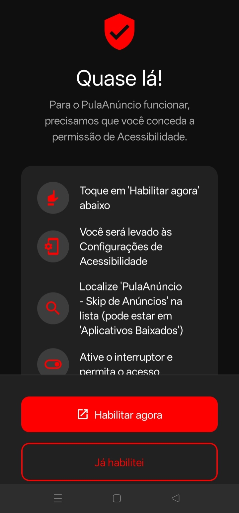
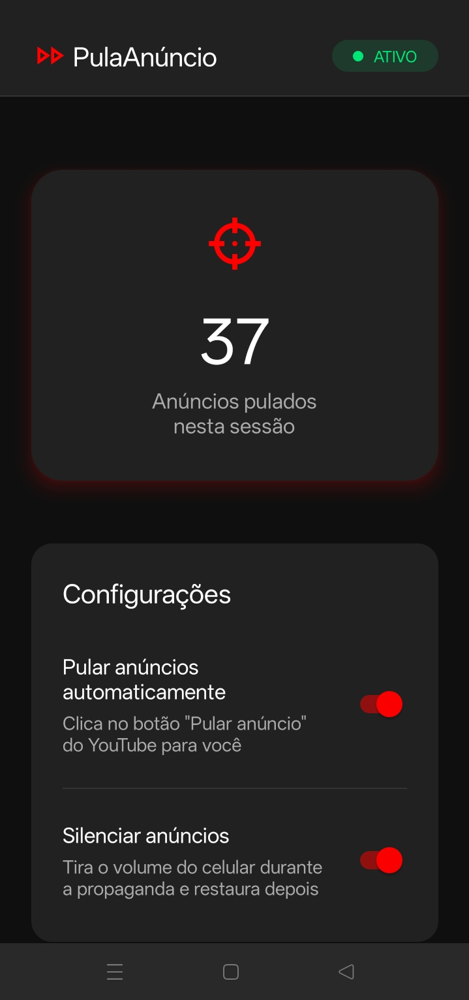

# PulaAnúncio (Auto Skip Ads) ⏭️

O **PulaAnúncio** é um aplicativo Android desenvolvido para pular anúncios do YouTube automaticamente. Ele utiliza os recursos nativos de Acessibilidade do Android para detectar e clicar no botão "Pular" na fração de segundo em que ele fica disponível, garantindo uma experiência de visualização contínua e sem interrupções.

---

## ✨ Funcionalidades
- **Auto Skip Instantâneo:** Clica automaticamente em "Pular Anúncio" no momento exato em que ele aparece.
- **Mute Inteligente:** Identifica quando um anúncio começou e força o volume do celular para 0 (mudo). Assim que o anúncio é pulado, restaura o volume exato que você estava usando antes.
- **Contador de Skips:** Uma interface minimalista e amigável que acompanha quantos anúncios foram pulados na sua sessão atual.
- **Ultra Leve e Otimizado:** Sem uso de bateria em excesso. O serviço "hiberna" e só acorda ao identificar o pacote oficial do YouTube na tela, sem processamentos pesados em segundo plano.

<p align="center">
  
  
</p>

---

## 🛠 Tecnologias e Arquitetura
O aplicativo usa uma arquitetura híbrida de alto desempenho:
- **Core (Motor de Automação):** Escrito em **Kotlin** puro utilizando a classe `AccessibilityService`. O core opera 100% nativo no Android, fazendo a leitura dos nós de tela e ajustando o volume via `AudioManager`.
- **Interface e Comunicação:** Escrita em **React Native / TypeScript**. A interface se comunica com o serviço em Kotlin através de um *Native Module* customizado e um sistema de *Broadcast Receiver* para atualizações em tempo real.

---

## 📥 Instalação (Atenção a esta etapa!)

Como este aplicativo requer permissões poderosas do Android (ler a tela e clicar em botões em seu nome) e não está listado na Google Play Store, a instalação exige alguns passos específicos de segurança.

### Passo 1: Instalar o APK
1. Baixe o arquivo `PulaAnuncio_v2.apk` (ou a versão mais recente nas Releases).
2. Tente instalar. O Android vai alertar que o aplicativo é de uma fonte desconhecida. Confirme que deseja **Instalar mesmo assim**.
3. *Aviso do Play Protect:* O Google Play Protect muito provavelmente emitirá um alerta vermelho de segurança (pois o app monitora a tela para achar o botão). Clique em **"Mais detalhes"** (setinha para baixo) e depois em **"Instalar assim mesmo"**.

#### *Obs.: Dependendo da sua versão do android, é possível que as opções dos passos anteriores não apareçam para você. Nesse caso, será necessário desativar temporariamente o Play Protect. Acesse a Play Store, toque na imagem da sua conta para abrir o `painel geral > Play Protect > Simbolo da engrenagem > Pause "Verificar apps"`. Após instalar, reative (o próprio Android reativará se o serviço estiver apenas pausado).

### Passo 2: Desbloquear Configurações Restritas (Android 13 ou superior)
O Android 13+ bloqueia **por padrão** o menu de acessibilidade de qualquer app instalado via APK. Para liberar:
1. Vá nas **Configurações** do seu celular.
2. Acesse **Aplicativos** > procure por **PulaAnúncio**.
3. Na tela de "Informações do aplicativo", olhe no **canto superior direito** e clique nos **três pontinhos verticais**.
4. Clique em **"Permitir configurações restritas"** (pode ser exigida a sua senha ou digital).

### Passo 3: Ativar o Serviço
1. Abra o aplicativo **PulaAnúncio**.
2. Na tela de Boas-Vindas, clique no botão para ir para as configurações de Acessibilidade.
3. Procure por "PulaAnúncio" na aba "Aplicativos Instalados".
4. Ligue a chave principal. Retorne ao app e pronto! A interface mudará para o Painel de Controle e ele já estará rodando invisível em segundo plano.

---

## 💻 Compilando a partir do Código-Fonte
Se você é desenvolvedor e quer compilar você mesmo:

```bash
# Clone o repositório
git clone https://github.com/seu-usuario/pulanuncio.git
cd pulanuncio

# Instale as dependências JavaScript
npm install

# Instale no celular/emulador (Para modo de Desenvolvimento)
npx react-native run-android

# Para compilar a versão Final (Release / APK)
cd android
./gradlew assembleRelease
# O APK final ficará em: android/app/build/outputs/apk/release/app-release.apk
```

---
